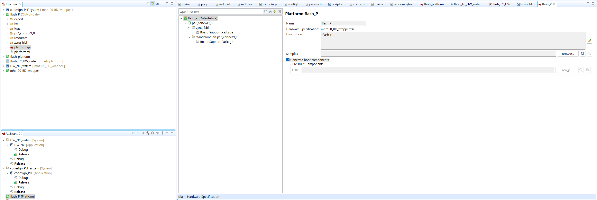
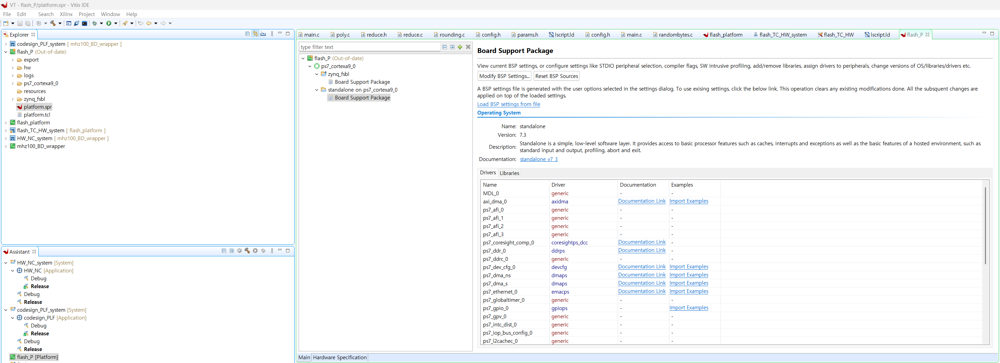
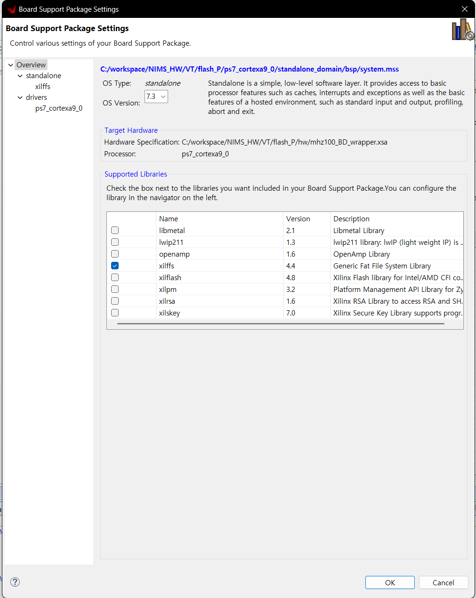
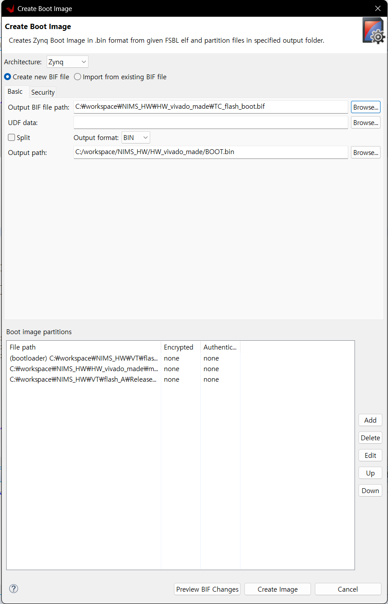
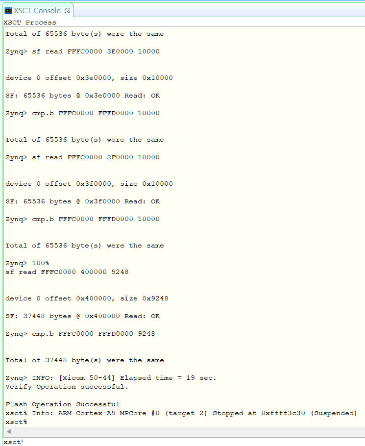
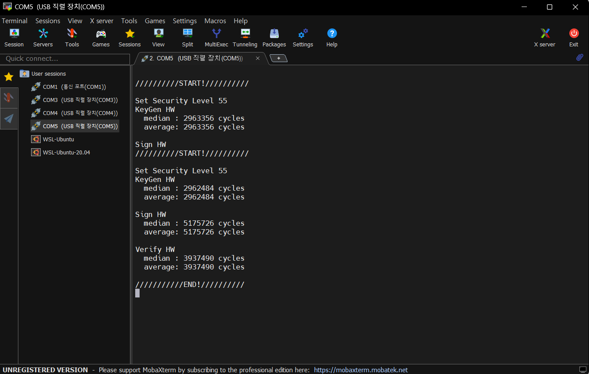

# ZedBoard QSPI Flash 부팅 가이드 (Vitis 2020.2)

본 문서는 **Vivado에서 만든 XSA(비트스트림 포함)** 를 이용해 Vitis에서
FSBL/앱을 빌드하고 **QSPI Flash(BOOT.BIN)** 로 부팅하는 전체 절차를 설명합니다.

---

## 0. 준비물
- Vivado 2020.2, Vitis 2020.2 (같은 버전 권장)
- ZedBoard, USB-JTAG/USB-UART 케이블
- **Vivado → File → Export Hardware (✔ Include bitstream)** 로 만든 `.xsa`
- 시리얼 터미널(MobaXterm/TeraTerm) 115200 8-N-1

---

## 1) Vivado에서 XSA 내보내기(확인)
1. **Generate Bitstream** 완료.
2. **File → Export Hardware… → Include bitstream 체크 → XSA 생성**  
   > XSA 내부에 `.bit` 포함됨. BOOT.BIN 생성 시 `.bit` 파일을 직접 지정해 사용.
   > XSA이 있는 경로에서 `.bit` 검색시 XSA와 동일한 이름의 파일이 존재.

---

## 2) Vitis Platform 생성
1. **File → New → Platform Project**
2. **XSA File:** (위에서 만든 XSA)
3. **Operating system:** `standalone`
4. **Processor:** `ps7_cortexa9_0`
5. **✔ Generate boot components** 체크 → **Finish**
6. ** 그림1 ** (flash_P/zynq_fsbl/platform.spr)


### 2-A) BSP 설정(xilffs 추가)
1. `platform.spr` 더블클릭 → 좌측 트리 `standalone on ps7_cortexa9_0 → Board Support Package` (사진 2)

2. **Modify BSP Settings… → Libraries 탭 → `xilffs` 체크** → OK (사진 3)

3. **`fsbl.elf` 생성 완료**

---

## 4) 사용자 앱(ELF) 생성/빌드
1. **File → New → Application Project**
2. Template: **Hello World**(테스트 권장) 또는 사용자 앱
3. **Build** → `app.elf` (Debug/Release 아무거나 사용 가능. 실사용은 Release 권장)
4. UART 출력은 `xil_printf()` 사용 권장

---

## 5) BOOT.BIN 생성 (Create Boot Image)
**Xilinx → Create Boot Image** 에서 다음 **순서**로 추가:
1. **`fsbl.elf`** → Partition type: **bootloader**
2. **`system.bit`** (Vivado 비트스트림)
3. **`app.elf`** (CPU: `ps7_cortexa9_0`) - (사진 4)


`Create Image` → `BOOT.BIN` 생성

## XSCT Console 사용 예시

Vitis 메뉴에서 **Xilinx → XSCT Console** 을 열고 아래 명령어들을 입력

```tcl
# hw_server와 연결
connect -url tcp:127.0.0.1:3121

# 타깃 장치 확인
targets

# Zynq 디바이스 선택 (예: xc7z020)
targets -set -nocase -filter {name =~ "xc7z020"}

# QSPI Flash에 BOOT.BIN 굽기
program_flash -f "C:/workspace/NIMS_HW/HW_vivado_made/BOOT.BIN" -fsbl "C:/workspace/NIMS_HW/VT/flash_P/zynq_fsbl/fsbl.elf" -offset 0 -flash_type qspi-x4-single -verify
```
console 완료시 사진 (사진 6)


완료시 사진 (사진 6)


보드 설정 (사진 7)
